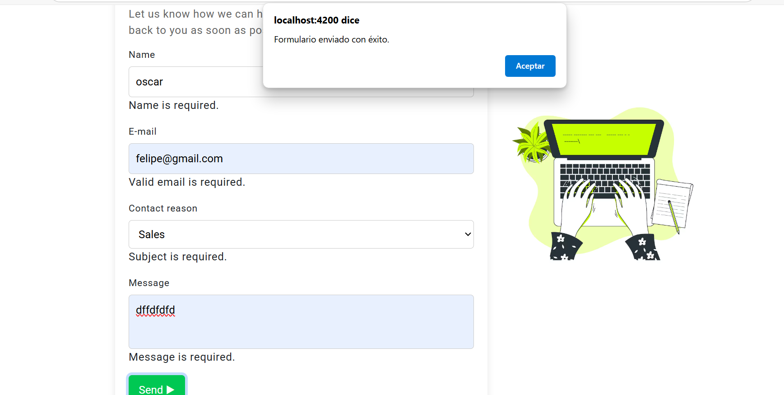
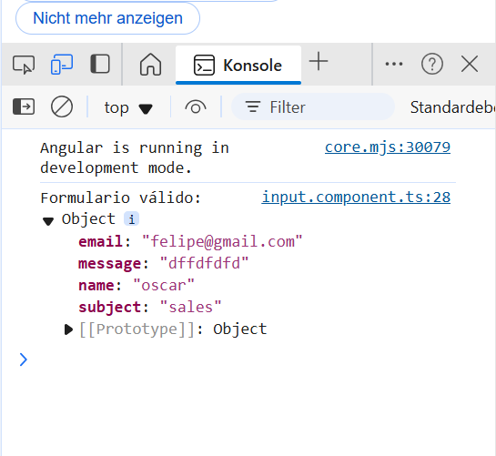

# PruebaAngular

This project was generated with [Angular CLI](https://github.com/angular/angular-cli) version 18.2.4.

## Development server

Run `ng serve` for a dev server. Navigate to `http://localhost:4200/`. The application will automatically reload if you change any of the source files.

## Code scaffolding

Run `ng generate component component-name` to generate a new component. You can also use `ng generate directive|pipe|service|class|guard|interface|enum|module`.

## Build

Run `ng build` to build the project. The build artifacts will be stored in the `dist/` directory.

## Running unit tests

Run `ng test` to execute the unit tests via [Karma](https://karma-runner.github.io).

## Running end-to-end tests

Run `ng e2e` to execute the end-to-end tests via a platform of your choice. To use this command, you need to first add a package that implements end-to-end testing capabilities.

## Further help

To get more help on the Angular CLI use `ng help` or go check out the [Angular CLI Overview and Command Reference](https://angular.dev/tools/cli) page.
# PruebaAngular

This project was generated with [Angular CLI](https://github.com/angular/angular-cli) version 18.2.4.

## Project Overview
PruebaAngular is a web application designed to [describe the main purpose and functionality of the application]. It features a modern user interface with components like navbar, banners, cards, and footer.

### Key Features
- Responsive design with multiple UI components
- Integration with Firebase services
- [Add other key features]

### Technologies Used
- Angular 18
- Firebase
- [Add other technologies]

## Installation & Setup
1. Clone the repository
2. Install dependencies:
   ```bash
   npm install
Configure Firebase (if needed):
[Add Firebase setup instructions]
Project Structure
src/app/
├── component/
│   ├── banner-uno/
│   ├── card/
│   ├── footer/
│   ├── header/
│   ├── input/
│   ├── navbar/
│   ├── publicidad/
│   └── section-one/
└── [other folders]

# Angular Project - Components & Navigation 

This Angular project implements a navigation structure with several main components, including Navbar, Input form, and various content sections.

## 📋 Project Structure

### Core Components

1. **Navbar Component**
   - Navigation bar with dark/light mode
   - Route navigation functionality
   - Uses localStorage for theme persistence
   ```typescript
   import { Component, Input } from '@angular/core';
   import { CommonModule } from '@angular/common';
   import { RouterModule, Router } from '@angular/router';
   ```

2. **Input Component**
   - Contact form with validations
   - Built with ReactiveFormsModule
   - Material UI integration
   ```typescript
   import { Component } from '@angular/core';
   import { FormBuilder, FormGroup, Validators, ReactiveFormsModule } from '@angular/forms';
   import { MatFormFieldModule } from '@angular/material/form-field';
   import { MatInputModule } from '@angular/material/input';
   import { MatButtonModule } from '@angular/material/button';
   ```

3. **Footer Component**
   - Contact information and quick links
   - Present across all pages
   ```typescript
   import { Component, Input } from '@angular/core';
   import { CommonModule } from '@angular/common';
   ```

### Additional Components

- **Card Component**: Dynamic content cards
- **Header Component**: Main header section
- **PublicidadComponent**: Advertising section
- **SectionOneComponent**: Featured information section with image

## 🛠 Installation & Setup

1. **Clone the repository**
   ```bash
   git clone <repository-url>
   cd proyecto-angular
   ```

2. **Install dependencies**
   ```bash
   npm install
   ```

3. **Run development server**
   ```bash
   ng serve
   ```

4. **Access the application**
   ```
   http://localhost:4200
   ```

## 🔀 Routing Configuration

The project uses Angular's RouterModule with the following configuration:

```typescript
import { Routes } from '@angular/router';
import { InputComponent } from './component/input/input.component';

export const routes: Routes = [
    { path: '', redirectTo: 'input', pathMatch: 'full' },
    { path: 'input', component: InputComponent },
    { path: '**', redirectTo: 'input', pathMatch: 'full' }
];
```

## 📌 Important Notes

- RouterModule must be imported in components using routerLink
- NavbarComponent can be configured to hide other components on /input route
- InputComponent form uses basic ReactiveFormsModule validations
- The project includes Material UI components for enhanced styling

## 💡 Component Features

### NavbarComponent
- Dynamic theme switching (dark/light mode)
- Navigation links to different sections
- Responsive design

### InputComponent
- Form validation
- Success/error alerts
- Form reset functionality
- Material UI form fields

### FooterComponent
- Quick links section
- Contact information
- Social media links

## 🔧 Technical Requirements

- Node.js
- Angular CLI
- NPM or Yarn
- Modern web browser

## 📱 Responsive Design

The application is fully responsive and works across different devices and screen sizes.

## 🤝 Contributing

1. Fork the repository
2. Create your feature branch
3. Commit your changes
4. Push to the branch
5. Create a new Pull Request

## 📄 License

This project is licensed under the MIT License - see the LICENSE file for details.


## pantallazos
 
 
 

## nota 

In the console you see the information